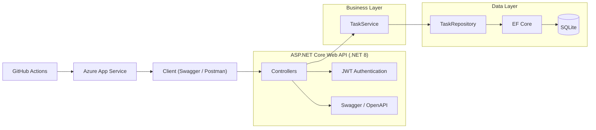
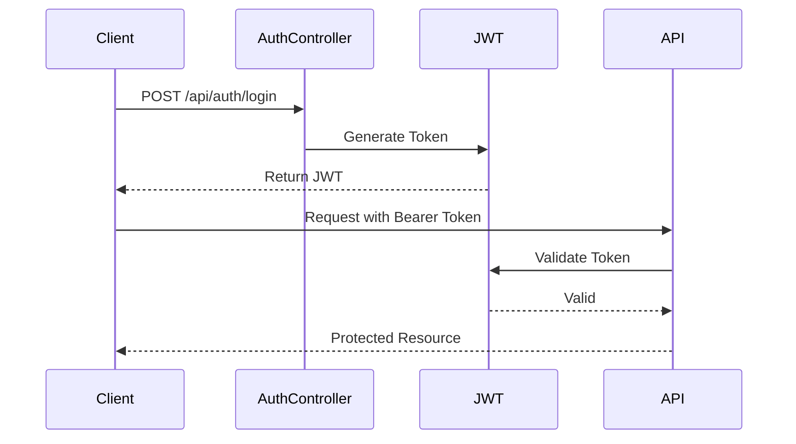
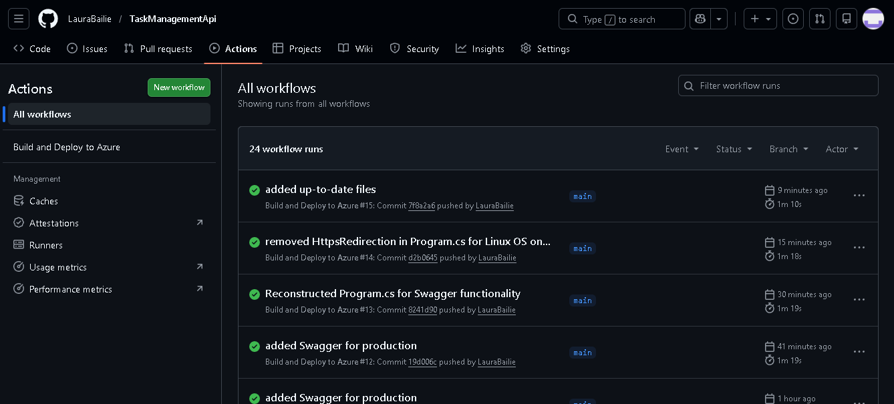
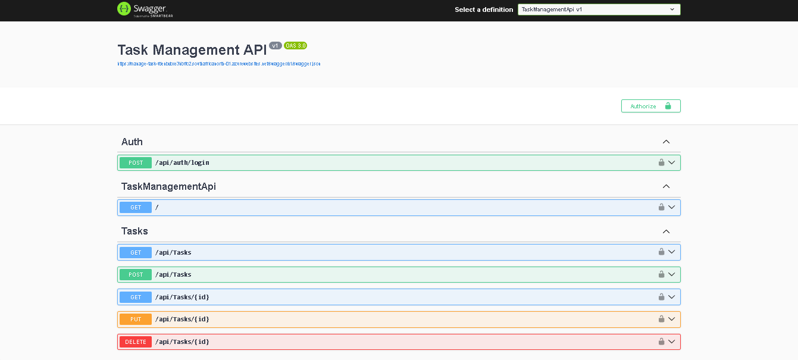

<div align="center">

# 📌 Task Management API

[]()
[]()
[]()
[]()

Production-ready ASP.NET Core Web API demonstrating secure authentication, clean architecture, automated testing, CI/CD, and Azure cloud deployment.

</div>

---

# 🌍 Live Demo

### 🔎 Swagger UI
👉 https://manage-task-fdenbvbxe3hbffc2.southafricanorth-01.azurewebsites.net/swagger

### ❤️ Health Check
👉 https://manage-task-fdenbvbxe3hbffc2.southafricanorth-01.azurewebsites.net/health

---

# 🚀 Overview

Task Management API is a secure RESTful API built using **ASP.NET Core (.NET 8)**.

It demonstrates real-world backend engineering practices:

- 🔐 JWT Authentication & Authorization
- 🧱 Clean Layered Architecture
- 🗄 Entity Framework Core (SQLite)
- 🧪 Unit Testing (xUnit + Moq)
- 🔄 CI/CD with GitHub Actions
- ☁️ Azure App Service Deployment
- 📊 Production Monitoring Ready

---

# 🏗 System Architecture

## Layered Architecture


Client → Controller → Service → Repository → Database





## 🔐 Authentication Flow




## 📷 Screenshots

✅ CI/CD Pipeline Success
<p align="center">  </p>
🔎 Swagger UI (Live Deployment)
<p align="center">  </p>


## 🔐 Features

- JWT-secured authentication

- Protected endpoints with [Authorize]

- Full CRUD task management

- Swagger UI with Bearer token support

- Health check endpoint

- Environment-based configuration

- Automated CI pipeline

- Production-ready cloud deployment


## 🧪 Testing Strategy

Unit tests validate:

- Business logic (Service layer)

- Repository interactions (mocked)

- Validation rules and expected outputs

- Testing Tools

- xUnit

- Moq

Tests run automatically via GitHub Actions.


## 🔄 CI/CD Pipeline

On every push to main:

- Restore dependencies

- Build solution

- Run unit tests

- Publish build artifacts

- Deploy to Azure App Service

- Ensures quality, reliability, and production stability.

## ☁️ Deployment & DevOps

Hosted on Azure App Service (Linux).

Configured with:

- GitHub Actions deployment workflow

- Secure publish profile secret

- Environment variables via Azure Configuration

- HTTPS enforced at platform level

- Production monitoring ready (Application Insights)


## ⚙️ Production Environment Variables

Configured in Azure:

Jwt__Key

Jwt__Issuer

Jwt__Audience

ConnectionStrings__DefaultConnection

ASPNETCORE_ENVIRONMENT=Production


## 🧪 Run Locally

```
    git clone https://github.com/LauraBailie/task-management-api.git
    cd task-management-api
    dotnet restore
    dotnet run
```


Open:

https://localhost:5253/swagger


## 📈 Future Enhancements

- Azure SQL integration

- Docker containerization

- Role-based authorization

- Front-end client (React or Blazor)

- Integration testing

- API versioning