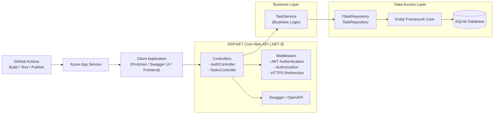
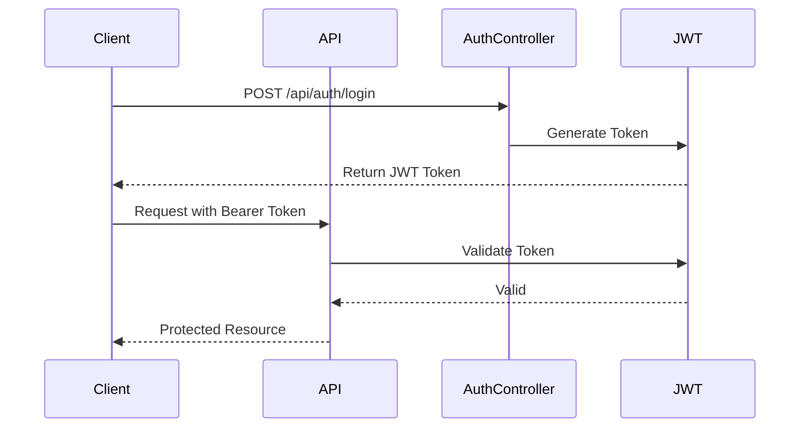

<div align="center"

    <h1>📌 Task Management API </h1>

    
    
    >

</div>

## Overview

Task Management API is a secure RESTful Web API built using **ASP.NET Core (.NET 8)**.  

The project demonstrates modern backend engineering practices including:

- JWT-based authentication & authorization
- Entity Framework Core (SQLite)
- Clean separation of concerns (Controllers, Services, Repositories)
- Swagger/OpenAPI documentation with secured endpoints
- Unit testing with xUnit and Moq
- Continuous Integration via GitHub Actions
- Cloud deployment-ready architecture

This project was designed to reflect production-ready backend development aligned with Agile and DevOps environments.

---

## Architecture Overview

The application follows a layered architecture:


Controller → Service → Repository → Database



### Architectural Principles

- Follows a layered architecture pattern
- Business logic isolated in service layer
- Repository pattern abstracts persistence
- JWT middleware secures protected routes
- Designed for scalability and testability
- CI/CD pipeline ensures build integrity before deployment





### Responsibilities

- **Controllers**: Handle HTTP requests and responses
- **Services**: Business logic layer
- **Repositories**: Data access abstraction
- **EF Core**: Database interaction
- **JWT Middleware**: Authentication & security enforcement

This separation ensures maintainability, scalability, and testability.

---

## Authentication & Security

- JWT token-based authentication
- Token validation (Issuer, Audience, Lifetime, Signing Key)
- Swagger integration with Bearer token support
- Authorization middleware enforced at controller level

---

## Testing Strategy

Unit tests validate:

- Service logic
- Repository interactions (mocked)
- Expected outputs and validation rules

Testing framework:
- xUnit
- Moq

Tests are executed automatically via GitHub Actions CI pipeline.

---

## CI/CD

On every push to `main`:

- Project restores dependencies
- Builds solution
- Runs unit tests
- Fails pipeline if tests fail

This ensures code quality and deployment stability.

---

🌍 Live Demo

Swagger UI:

👉
https://manage-task-fdenbvbxe3hbffc2.southafricanorth-01.azurewebsites.net/swagger

Health check endpoint:

👉
https://manage-task-fdenbvbxe3hbffc2.southafricanorth-01.azurewebsites.net/health


### Example Flow

1. POST `/api/auth/login`
2. Copy JWT token
3. Click “Authorize” in Swagger
4. Enter:

Bearer <your_token>

5. Access protected endpoints

---

🧪 How To Run Locally 

```bash
git clone https://github.com/LauraBailie/task-management-api.git
cd task-management-api
dotnet restore
dotnet run
```

Navigate to:

https://localhost:5253/swagger


🏗 Architecture


🔐 Features

- User authentication with JWT

- Secure endpoints with [Authorize]

- CRUD task operations

- Swagger with JWT support

- Health check endpoint

- Production environment configuration


CI/CD pipeline with automated test & deployment

🚀 DevOps & Deployment

This project uses:

- GitHub Actions for CI/CD

- Automated build & test on push to main

- Secure secret management via GitHub Secrets

- Azure App Service for hosting

- Environment variables configured via Azure


⚙️ Environment Variables (Production)

Configured in Azure App Service:

Jwt__Key

Jwt__Issuer

Jwt__Audience

ConnectionStrings__DefaultConnection

ASPNETCORE_ENVIRONMENT=Production


📈 Future Improvements

- Azure SQL integration

- Docker containerization

- Role-based authorization

- Frontend client (React or Blazor)

- Integration tests

- API versioning